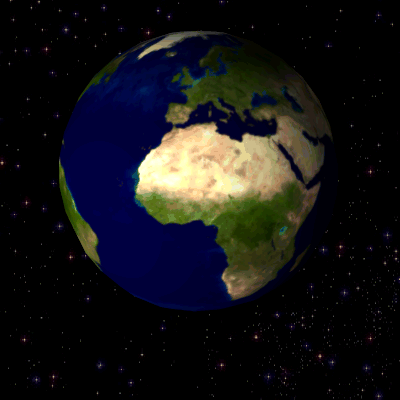

# magick 

##### *Advanced Image-Processing in R*

[](https://travis-ci.org/ropensci/magick)
[](https://ci.appveyor.com/project/jeroenooms/magick)
[](https://codecov.io/github/ropensci/magick?branch=master)
[](https://cran.r-project.org/package=magick)
[](https://cran.r-project.org/package=magick)
[](https://github.com/ropensci/magick)

> Bindings to ImageMagick: the most comprehensive open-source image
  processing library available. Supports many common formats (png, jpeg, tiff,
  pdf, etc) and manipulations (rotate, scale, crop, trim, flip, blur, etc).
  All operations are vectorized via the Magick++ STL meaning they operate either
  on a single frame or a series of frames for working with layers, collages,
  or animation. In RStudio images are automatically previewed when printed to
  the console, resulting in an interactive editing environment.

## Documentation

About the underlying library:

 - [Magick++ STL Documentation](https://www.imagemagick.org/Magick++/STL.html)

## Hello World

**Run examples in RStudio** to see a live previews of the images! If you do not use RStudio, use `image_browse` to open images. On Linux you can also use `image_display` to get an X11 preview.

```{r eval = FALSE}
library(magick)
library(magrittr)
frink <- image_read("https://jeroenooms.github.io/images/frink.png")
image_trim(frink)
image_scale(frink, "200x200")
image_flip(frink)
image_rotate(frink, 45) ## <-- result of this is shown
image_negate(frink)
frink %>% 
  image_background("green") %>% 
  image_flatten() %>%
  image_border("red", "10x10")
```

```{r eval = FALSE, include = FALSE}
image_rotate(frink, 45) %>% image_write("img/frink-rotated.png")
```


Effects

```{r eval = FALSE}
image_oilpaint(frink)
image_implode(frink)
image_charcoal(frink) ## <-- result of this is shown
image_blur(frink)
image_edge(frink)
```

```{r eval = FALSE, include = FALSE}
library(magrittr)
image_charcoal(frink) %>% image_write("img/frink-charcoal.png")
```


Create GIF animation:

```{r eval = FALSE}
# Download images
oldlogo <- image_read("https://developer.r-project.org/Logo/Rlogo-2.png")
newlogo <- image_read("https://www.r-project.org/logo/Rlogo.png")
logos <- c(oldlogo, newlogo)
logos <- image_scale(logos, "400x400")

# Create GIF
(animation1 <- image_animate(logos))
image_write(animation1, "img/anim1.gif")

# Morph effect  <-- result of this is shown
(animation2 <- image_animate(image_morph(logos, frames = 10)))
image_write(animation2, "img/anim2.gif")
```


Read GIF anination frames. See the [rotating earth example GIF](https://upload.wikimedia.org/wikipedia/commons/2/2c/Rotating_earth_%28large%29.gif).

```{r eval = FALSE}
earth <- image_read("https://upload.wikimedia.org/wikipedia/commons/2/2c/Rotating_earth_%28large%29.gif")
length(earth)
earth[1]
earth[1:3]
earth1 <- rev(image_flip(earth)) ## How Austrialans see earth
image_write(earth1, "img/earth1.gif") ## <-- result of this is shown
```



R logo with dancing banana

```{r eval = FALSE}
logo <- image_read("https://www.r-project.org/logo/Rlogo.png")
banana <- image_read("https://jeroenooms.github.io/images/banana.gif")
front <- image_scale(banana, "300")
background <- image_scale(logo, "400")
frames <- lapply(as.list(front), function(x) image_flatten(c(background, x)))
image_write(image_animate(image_join(frames)), "img/Rlogo-banana.gif")
```


## Installation

Binary packages for __OS-X__ or __Windows__ can be installed directly from CRAN:

```r
install.packages("magick")
```

Installation from source on Linux or OSX requires the imagemagick [`Magick++`](https://www.imagemagick.org/Magick++/Documentation.html) library. On __Debian or Ubuntu__ install [libmagick++-dev](https://packages.debian.org/testing/libmagick++-dev):

```
sudo apt-get install -y libmagick++-dev
```

On __Fedora__,  __CentOS or RHEL__ we need [ImageMagick-c++-devel](https://apps.fedoraproject.org/packages/ImageMagick-c++-devel):

```
sudo yum install ImageMagick-c++-devel
````

On __OS-X__ use [imagemagick](https://github.com/Homebrew/homebrew-core/blob/master/Formula/imagemagick.rb) from Homebrew. Note that we need to build `--with-fontconfig` to support text features such as annotation and svg rendering.

```
brew install imagemagick --with-fontconfig --with-librsvg --with-fftw
```

There is also a fork of imagemagick called graphicsmagick, but it doesn't work as well. I highly recommend you build with imagemagick.

[](http://ropensci.org)
