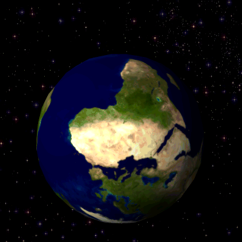

# rOpenSci: The *magick* package 

> Advanced Image-Processing in R

<!-- badges: start -->
[](https://www.repostatus.org/#active)
[](https://ci.appveyor.com/project/jeroen/magick)
[](https://cran.r-project.org/package=magick)
[](https://cran.r-project.org/package=magick)
[](https://github.com/ropensci/magick/actions)
<!-- badges: end -->

Bindings to ImageMagick: the most comprehensive open-source image
processing library available. Supports many common formats (png, jpeg, tiff,
pdf, etc) and manipulations (rotate, scale, crop, trim, flip, blur, etc).
All operations are vectorized via the Magick++ STL meaning they operate either
on a single frame or a series of frames for working with layers, collages,
or animation. In RStudio images are automatically previewed when printed to
the console, resulting in an interactive editing environment.

## Documentation

About the R package:

  - [Getting started: The magick package: Advanced Image-Processing in R](https://docs.ropensci.org/magick/articles/intro.html)
  - [rOpenSci Community Call (recording)](https://vimeo.com/channels/rocommunitycalls/180799058)

About the underlying library:

 - [Magick++ Tutorial](https://www.imagemagick.org/Magick++/tutorial/Magick++_tutorial.pdf)
 - [Magick++ STL Documentation](https://www.imagemagick.org/Magick++/STL.html)

## Hello World

**Run examples in RStudio** to see live previews of the images! If you do not use RStudio, use `image_browse` to open images. On Linux you can also use `image_display` to get an X11 preview.

```r
library(magick)
frink <- image_read("https://jeroen.github.io/images/frink.png")
image_trim(frink)
image_scale(frink, "200x200")
image_flip(frink)
image_rotate(frink, 45) ## <-- result of this is shown
image_negate(frink)
frink %>% 
  image_background("green") %>% 
  image_flatten() %>%
  image_border("red", "10x10")
```

```r
image_rotate(frink, 45) %>% image_write("man/figures/frink-rotated.png")
```


Effects

```r
image_oilpaint(frink)
image_implode(frink)
image_charcoal(frink) ## <-- result of this is shown
image_blur(frink)
image_edge(frink)
```

```r
image_charcoal(frink) %>% image_write("man/figures/frink-charcoal.png")
```


Create GIF animation:

```r
# Download images
oldlogo <- image_read("https://developer.r-project.org/Logo/Rlogo-2.png")
newlogo <- image_read("https://jeroen.github.io/images/Rlogo-old.png")
logos <- c(oldlogo, newlogo)
logos <- image_scale(logos, "400x400")

# Create GIF
(animation1 <- image_animate(logos))
image_write(animation1, "man/figures/anim1.gif")

# Morph effect  <-- result of this is shown
(animation2 <- image_animate(image_morph(logos, frames = 10)))
image_write(animation2, "man/figures/anim2.gif")
```


Read GIF animation frames. See the [rotating earth example GIF](https://upload.wikimedia.org/wikipedia/commons/2/2c/Rotating_earth_%28large%29.gif).

```r
earth <- image_read("https://upload.wikimedia.org/wikipedia/commons/2/2c/Rotating_earth_%28large%29.gif")
length(earth)
earth[1]
earth[1:3]
earth1 <- rev(image_flip(earth)) ## How Austrialans see earth
image_write(earth1, "man/figures/earth1.gif") ## <-- result of this is shown
```



R logo with dancing banana

```r
logo <- image_read("https://www.r-project.org/logo/Rlogo.png")
banana <- image_read("https://jeroen.github.io/images/banana.gif")
front <- image_scale(banana, "300")
background <- image_scale(logo, "400")
frames <- lapply(as.list(front), function(x) image_flatten(c(background, x)))
image_write(image_animate(image_join(frames)), "man/figures/Rlogo-banana.gif")
```


## Use magick in Shiny Apps

This demo application shows how to use magick with shiny: https://github.com/jeroen/shinymagick

## Installation

Binary packages for __macOS__ or __Windows__ can be installed directly from CRAN:

```r
install.packages("magick")
```

Installation from source on Linux or OSX requires the imagemagick [`Magick++`](https://www.imagemagick.org/Magick++/Documentation.html) library. On __Debian or Ubuntu__ install [libmagick++-dev](https://packages.debian.org/testing/libmagick++-dev):

```
sudo apt-get install -y libmagick++-dev
```

If you are on __Ubuntu__ 14.04 (trusty) or 16.04 (xenial) you can get a more recent backport from the ppa:

```
sudo add-apt-repository -y ppa:cran/imagemagick
sudo apt-get update
sudo apt-get install -y libmagick++-dev 
```

On __Fedora__,  __CentOS or RHEL__ we need [ImageMagick-c++-devel](https://src.fedoraproject.org/rpms/ImageMagick). However on CentOS the system version of ImageMagick is quite old. More recent versions are available from the [ImageMagick downloads](https://www.imagemagick.org/download/linux/CentOS/x86_64/) website.

```
sudo yum install ImageMagick-c++-devel
````

On __macOS__ use [imagemagick@6](https://github.com/Homebrew/homebrew-core/blob/master/Formula/imagemagick@6.rb) from Homebrew.

```
brew install imagemagick@6
```

The unversioned homebrew formula`imagemagick` can also be used, however it has some unsolved OpenMP problems. 

There is also a fork of imagemagick called graphicsmagick, but this doesn't work for this package.
